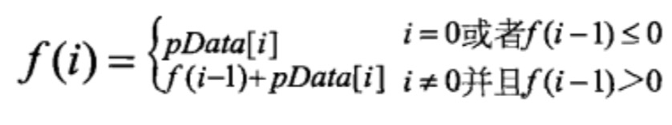

# 053-最大子序和

## 题目

leetcode：[053-最大子序和](https://leetcode-cn.com/problems/maximum-subarray/)

## 暴力破解

枚举出所有子数组并求出它们的和，从中找出最大值。

暴力破解方法的时间复杂度为**O(n^2)**。

代码略。

## 分治

最大子序列和可能出现在三个地方：出现在数据的左半部分，出现在数据的右半部分，或者包含中间，同时涉及到左右两部分，则：

1. 找出左半部分的最大子段和。
2. 找出有半部分的最大子段和。
3.  包含中间，同时涉及到左右两部分的最大子段和。
4.  比较以上三个值，找出最大子段和。

分治的时间复杂度为**O(nlogn)**。

```c++
class Solution {
public:
    int maxSubArray(vector<int> &nums) {
        if (nums.empty()) {
            return 0;
        }

        return maxSum(nums, 0 ,nums.size() - 1);
    }

private:
    int maxSum(vector<int> &nums, int left, int right) {
        if (left == right) {
            return nums[left];
        }

        int center = (left + right) / 2;
        int maxLeftSum = maxSum(nums, left, center); // 计算左半部分最大子段和
        int maxRightSum = maxSum(nums, center + 1, right); // 计算右半部分最大子段和

        /**
         * 计算包含中间，同时涉及到左右两部分的最大子段和
         */
        int maxLeftBorderSum = nums[center], leftBorderSum = 0;
        for (int i = center; i >= left; --i) {
            leftBorderSum += nums[i];
            if (leftBorderSum > maxLeftBorderSum) {
                maxLeftBorderSum = leftBorderSum;
            }
        }

        int maxRightBorderSum = nums[center + 1], rightBorderSum = 0;
        for (int j = center + 1; j <= right; ++j) {
            rightBorderSum += nums[j];
            if (rightBorderSum > maxRightBorderSum) {
                maxRightBorderSum = rightBorderSum;
            }
        }

        return max(maxLeftSum, maxRightSum, maxLeftBorderSum + maxRightBorderSum);
    }

    int max(int n, int m, int l) {
        int max;
        max = n > m ? n : m;
        if (l > max) {
            max = l;
        }

        return max;
    }
};
```

## 动态规划

如果用函数 f(i) 表示以第 i 个数字结尾的子数组的最大和，那么我们需要求出 max(f[0...n])。我们可以给出如下递归公式求 f(i)：



这个公式的意义：

1. 当以第 (i-1) 个数字为结尾的子数组中所有数字的和 f(i-1) 小于 0 时，如果把这个负数和第 i 个数相加，得到的结果反而不第 i 个数本身还要小，所以这种情况下最大子数组和是第 i 个数本身。
2. 如果以第 (i-1) 个数字为结尾的子数组中所有数字的和 f(i-1) 大于 0，与第 i 个数累加就得到了以第 i 个数结尾的子数组中所有数字的和。

动态规划的时间复杂度为**O(n)**。

```c++
class Solution {
public:
    int maxSubArray(vector<int> &nums) {
        int sum = 0;
        int result = INT_MIN;
        for (const auto& num : nums) {
            sum += num;
            if (sum > result) {
                result = sum;
            }

            if (sum < 0) {
                sum = 0;
            }
        }

        return result;
    }
};
```

