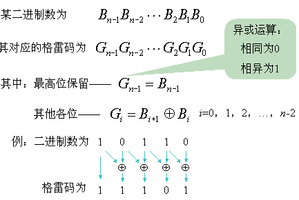

# 089-格雷编码

## 题目

leetcode：[089-格雷编码](https://leetcode-cn.com/problems/gray-code/)

## 思路

根据[维基百科中格雷码](https://zh.wikipedia.org/wiki/格雷码)的性质解题：

- [直接排列](https://zh.wikipedia.org/wiki/格雷码#直接排列)
- [镜射排列](https://zh.wikipedia.org/wiki/格雷码#镜射排列)
- [二进制数转格雷码](https://zh.wikipedia.org/wiki/格雷码#直接排列)

## 直接排列

根据[维基百科中关于直接排列的描述](https://zh.wikipedia.org/wiki/格雷码#直接排列)，这是一种动态规划的方法。

```c++
class Solution {
public:
    vector<int> grayCode(int n) {
        int size = 1 << n; // 即 2 ^ n
        vector<int> result(size, 0);
        for (int i = 1; i < size; ++i) {
            int previous = result[i - 1];
            if (i % 2 == 1) {
                result[i] = previous ^ 1;
            } else {
                int tmp = previous;
                for (int j = 0; j < n; ++j) {
                    if ((tmp & 1) == 1) {
                        previous ^= 1 << (j + 1); // 注意：j从0开始。
                        result[i] = previous;
                        break;
                    }
                    tmp >>= 1;
                }
            }
        }

        return result;
    }
};
```

## 镜射排列

该方法使用递归可以很容易实现。

```c++
class Solution {
public:
    vector<int> grayCode(int n) {
        vector<int> result(1 << n);

        grayCodeRecursion(result, 1, n);

        return result;
    }

private:
    void grayCodeRecursion(vector<int> &result, int bitCount, int n) {
        if (bitCount > n) {
            return;
        }

        for (int i = 1 << (bitCount - 1), j = i - 1; i < 1 << bitCount; ++i, --j) {
            result[i] = result[j] + (1 << (bitCount - 1));
        }

        grayCodeRecursion(result, bitCount + 1, n);
    }
};
```

## 二进制数转格雷码

公式：`G(n)=B(n+1) XOR B(n)`，其中G：格雷码 B：二进制码 n：正在计算的位 。



```c++
class Solution {
public:
    vector<int> grayCode(int n) {
        int size = 1 << n; // 即 2 ^ n
        vector<int> result(size, 0);
        for (int i = 0; i < size; ++i) {
            result[i] = i ^ (i >> 1);
        }

        return result;
    }
};
```

