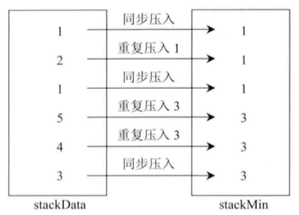
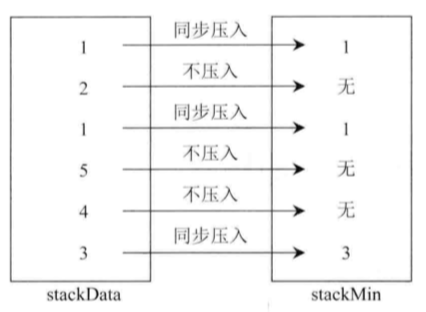

# 155-最小栈

## 题目

leetcode：[155-最小栈](https://leetcode-cn.com/problems/min-stack/)

## 两个栈1

使用两个栈，一个栈（stackData）保存数据，一个栈（stackMin）保存最小值。

- 入栈：如果栈为空，则将x压入两个栈中。如果栈不为空，将x压入stackData中，将`min{x, stackMin.top()}`压入stackMin中。
- 出栈：栈不为空时，将两个栈的栈顶元素弹出。
- 查询栈顶元素：stackData不为空时，返回stackData栈顶元素。
- 查询最小值：stackMin不为空时，返回stackMin栈顶元素。

栈的对应关系如下图，一次压入3、4、5、1、2、1。



```c++
class MinStack {
public:
    /** initialize your data structure here. */
    MinStack() {

    }
    
    void push(int x) {
        dataStack.push(x);
        if (minStack.empty()) {
            minStack.push(x);
        } else {
            minStack.push(min(x, minStack.top()));
        }
    }
    
    void pop() {
        if (!dataStack.empty() && !minStack.empty()) {
            dataStack.pop();
            minStack.pop();
        }
    }
    
    int top() {
        if (!dataStack.empty()) {
            return dataStack.top();
        }

        return -1;
    }
    
    int getMin() {
        if (!minStack.empty()) {
            return minStack.top();
        }

        return -1;
    }

private:
    stack<int> dataStack; // 储存数据的栈
    stack<int> minStack; // 存储最小值得栈
};
```

## 两个栈2

该方法也是使用两个栈，与方法1不同的是`stackMin`保存最小值的策略不同，体现在入栈和出栈操作中。

- 入栈：如果stackMin为空，将x压入stackMin中。如果stackMin不为空，只有当x小于等于stackMin.top()时，才将x压入stackMin。
- 出栈：如果stackMin不为空，且stackData出栈的元素与stackMin栈顶元素相等，则stackMin将栈顶元素弹出。

栈的对应关系如下图，一次压入3、4、5、1、2、1。



```c++
class MinStack {
public:
    /** initialize your data structure here. */
    MinStack() {

    }
    
    void push(int x) {
        dataStack.push(x);
        if (minStack.empty() || x <= getMin()) {
            minStack.push(x);
        }
    }
    
    void pop() {
        if (!minStack.empty() && dataStack.top() == getMin()) {
            minStack.pop();
        }
        if (!dataStack.empty()) {
            dataStack.pop();
        }
    }
    
    int top() {
        if (!dataStack.empty()) {
            return dataStack.top();
        }

        return -1;
    }
    
    int getMin() {
        if (!minStack.empty()) {
            return minStack.top();
        }

        return -1;
    }

private:
    stack<int> dataStack; // 储存数据的栈
    stack<int> minStack; // 存储最小值得栈
};
```

## 注

图片来自[《程序员代码面试指南：IT名企算法与数据结构题目最优解》](https://book.douban.com/subject/26638586/)，侵删。